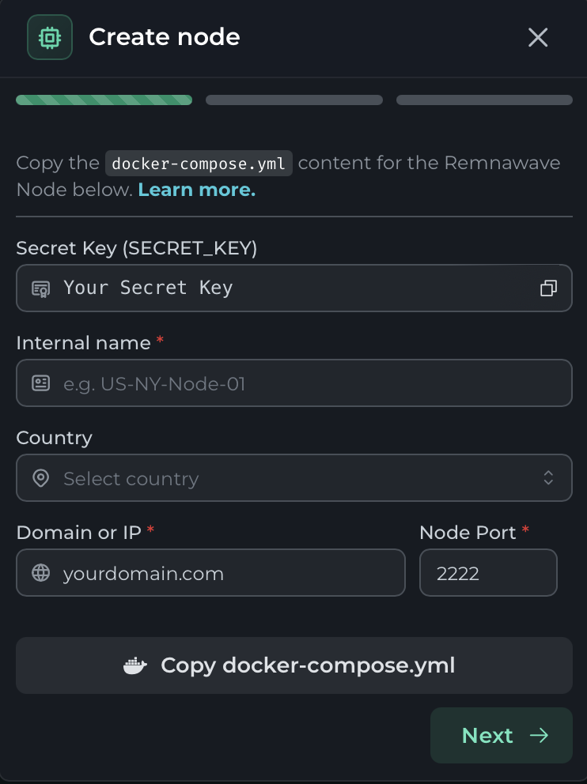
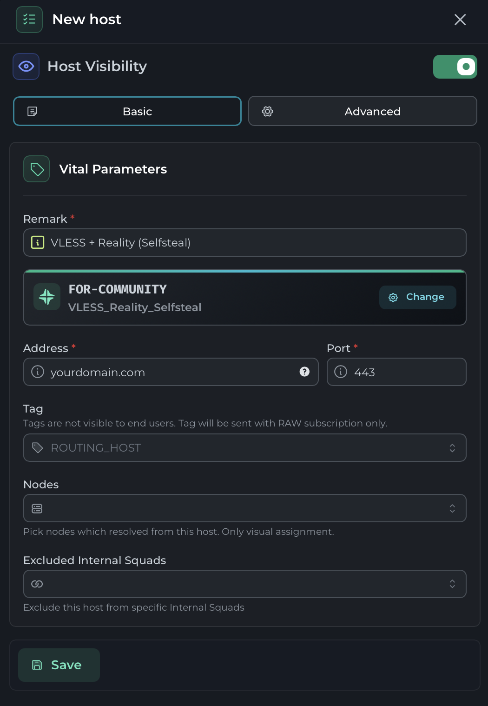

# Базовая настройка протокола VLESS с конфигурацией транспорта RAW + Reality
### На VPS Ваш домен (усл. yourdomain.com) используется всего в 3 местах и в 6 строках:
1) Файл server.json: <br>
30 строка:   ("**yourdomain.com**" // Replace with your domain)<br>

2) Файл nginx.conf:  <br>
12 строка:   server_name yourdomain.com;<br>
14 строка:   ssl_certificate "/etc/letsencrypt/live/**yourdomain.com**/fullchain.pem";<br>
15 строка:   ssl_certificate_key "/etc/letsencrypt/live/**yourdomain.com**/privkey.pem";<br>
16 строка:   ssl_trusted_certificate "/etc/letsencrypt/live/**yourdomain.com**/chain.pem";<br>

3) Команда для выдачи сертификатов: <br>
```bash
certbot certonly --standalone -d **yourdomain.com** --non-interactive --agree-tos -m admin@example.com <br>
```

### В панели Remnawave Ваш домен используется в двух местах:



### Базовая терминология для дальнейшей успешной работы:
Протокол (Protocol): VLESS, Trojan, Hysteria - это то, что вы вводите в "protocol": "...",<br>
- Имеет свои настройки: <br>"settings": {"...", "..."}<br>

Транспорт (Transport Methods): RAW (бывш. TCP), XHTTP, Hysteia, - это то, что вы вводите в "network": "...",<br>
- Определяет, как именно переносится поток данных, например через RAW, WebSocket, gRPC, Hysteria и другие.<br>
- Имеет свои настройки  <br>- "rawSettings": {"...", "..."} (в нашем примере пустой),<br>
                        - "xhttpSettings": {"...", "..."},<br>
                        - "kcpSettings": {"...", "..."},<br>
                        - "grpcSettings": {"...", "..."},<br>
                        - "wsSettings": {"...", "..."},<br>
                        - "httpupgradeSettings": {"...", "..."},<br>
                        - "hysteriaSettings": {"...", "..."}<br>

Безопасность транспорта (Transport Security): TLS, Reality - это то, что вы вводите в "security": "...",<br>
- Определяет механизм защиты, например TLS или REALITY.<br>
- Имеет свои настройки: <br>- "realitySettings": {"...", "..."} (Выбор в нашем примере),<br>
                        - "tlsSettings": {"...", "..."}<br>

Эти три группы относятся к разным уровням и в определенных пределах могут комбинироваться<br>

